Thank you for investing your time in contributing to our project! Any contribution you make will be reflected on our [GitHub](https://github.com/FCLOGO/fclogo.top) ✨.

Join our [Discord](https://discord.gg/gVcbysaEWD) server for more information.

In this document, you will learn about the complete workflow for contributing a vector logo to us. Use the table of contents in the top right corner to quickly navigate to specific sections of this guide.

## 🛠️ Preparation

### Vector Graphics Editor

There are many vector graphics editors available for various platforms. We recommend using [Adobe Illustrator](https://www.adobe.com/products/illustrator.html).

You can also choose other suitable tools according to your needs. Here are some popular vector graphics editors:

- [Affinity Designer](https://affinity.serif.com/en-us/designer/)
- [Figma](https://www.figma.com/)
- [INKSCAPE](https://inkscape.org/)
- [Sketch](https://www.sketch.com/)
- [CorelDRAW](https://www.coreldraw.com/)

### Setting Up the Development Environment

This section will guide you through installing the following tools:

- Node.js
- Git
- Visual Studio Code

Before installing these tools, it is best to have some basic understanding of **command line** tools. The usage of command line tools varies slightly depending on the operating system:

- [macOS Command Line Guide](https://www.macworld.co.uk/feature/mac-software/how-use-terminal-on-mac-3608274/)
- [Windows Command Line Guide](https://www.lifewire.com/how-to-open-command-prompt-2618089)
- [Linux Command Line Guide](https://www.howtogeek.com/140679/beginner-geek-how-to-start-using-the-linux-terminal/)

#### Installing Node.js

[Node.js](https://nodejs.org/en) is an environment that allows you to run JavaScript code outside of a web browser. Our project is built using Gatsby. To get Gatsby up and running, you need to install Node.js version 18 (or higher, but below v21) on your computer.

> The current Node.js version used by this project is: v20.18.1

For easier management, it is recommended to use Node version managers like [nvm](https://github.com/nvm-sh/nvm) or [fnm](https://github.com/Schniz/fnm). You also need to install a package manager, and we recommend using [Yarn](https://yarnpkg.com/).

For example, on macOS, the installation steps are as follows:

```shell
# Install nvm:
curl -o- https://raw.githubusercontent.com/nvm-sh/nvm/v0.40.1/install.sh | bash

# Install Node.js:
nvm install v20.18.1

# Verify Node.js version:
node -v # Should output "v20.18.1".
nvm current # Should output "v20.18.1".

# Install Yarn:
corepack enable yarn

# Verify Yarn version:
yarn -v
```

For installation methods on other platforms, please refer to: 👉 https://nodejs.org/en/download

#### Installing Git

[Git](https://git-scm.com/) is a free and open-source distributed version control system. It helps you save different versions of your code and allows team members to collaborate on the same codebase simultaneously.

The steps to download and install Git depend on your operating system. Please follow the guide for your system:

- [Installing Git on macOS](https://www.atlassian.com/git/tutorials/install-git#mac-os-x)
- [Installing Git on Windows](https://www.atlassian.com/git/tutorials/install-git#windows)
- [Installing Git on Linux](https://www.atlassian.com/git/tutorials/install-git#linux)

#### Installing Visual Studio Code

[Visual Studio Code](https://code.visualstudio.com/) (also known as VS Code) is a popular code editor used for writing code for projects. If you do not have a preferred code editor, visit the VS Code site and download the version suitable for your platform.

Of course, you can also use other code editors.

#### Creating a Github Account

All the code for this project is stored on Github. Therefore, you need to [create a Github account](https://docs.github.com/en/get-started/start-your-journey/creating-an-account-on-github) to pull, push, and commit code.

After creating your Github account, you can refer to the following documents to set up Git and learn some basic operations:

- [Setting Up Git](https://docs.github.com/en/get-started/getting-started-with-git/set-up-git)
- [GitHub Flow](https://docs.github.com/en/get-started/using-github/github-flow)
- [Collaborating with Pull Requests](https://docs.github.com/en/pull-requests/collaborating-with-pull-requests)

### Forking the Project and Pulling the Latest Code

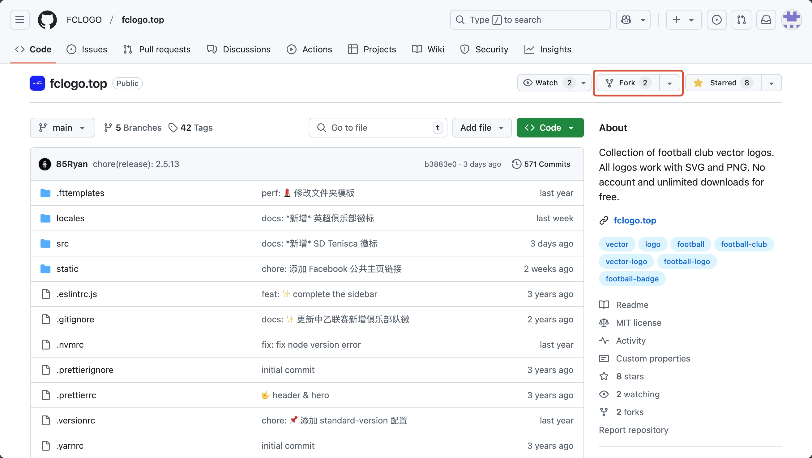

Find the project homepage on [Github](https://github.com/FCLOGO/fclogo.top) and click the `fork` button in the top right corner to fork the project.

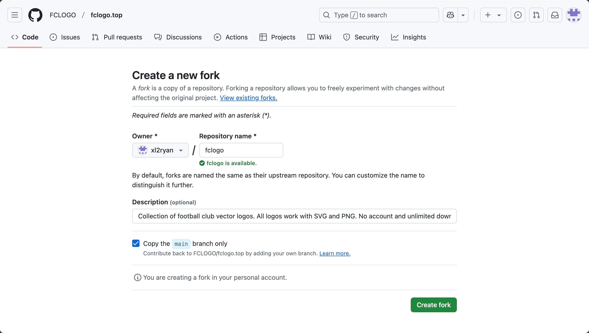

You can rename the project if needed, then click the `Create fork` button to complete the forking process.

At this point, you have forked the entire project into your own repository, as shown below:

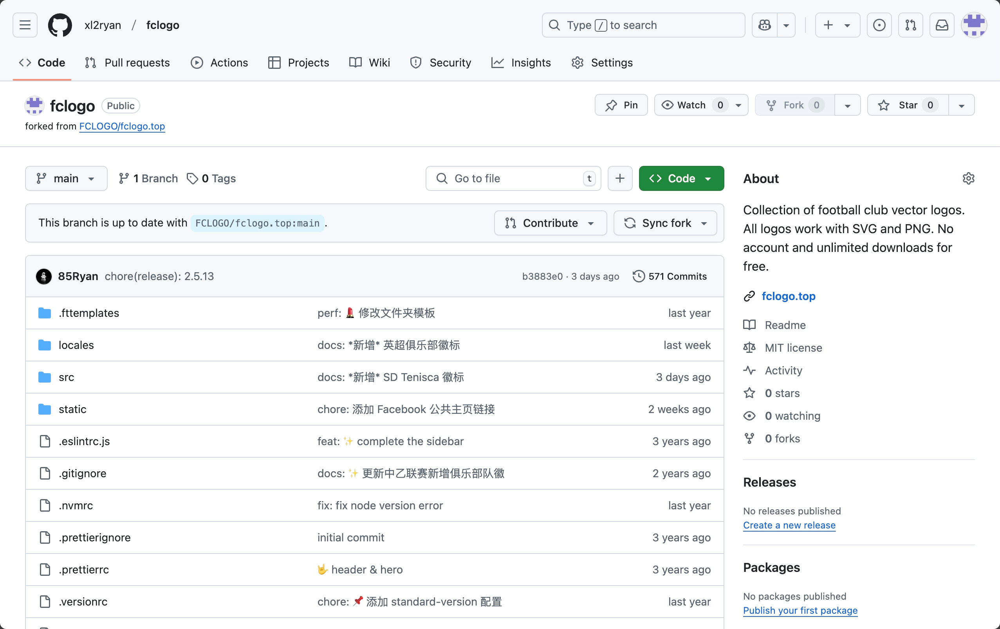

### Creating a Local Copy of the Project

Next, we need to clone the project files to your computer for further modifications.

1. At the top of the project file list, click the `<> code` button and copy the repository URL (HTTPS/SSH as needed). (Here we use SSH as an example)

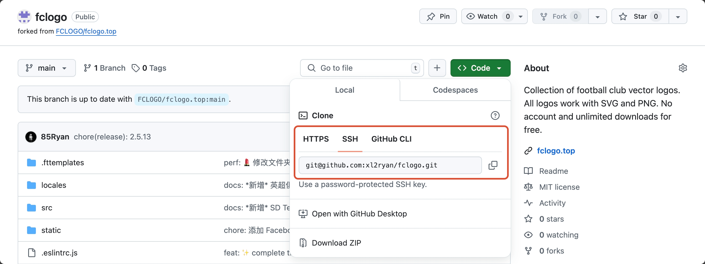

2. Open a terminal or other command line tool, change the current directory to the location where you want to store the cloned directory, and type `git clone` followed by the URL you copied earlier. As shown below:

```shell
# Replace the project URL with your own project URL

git clone git@github.com:xl2ryan/fclogo.git

```
3. Press Enter and wait for the process to complete. This will create a copy of the project on your computer.

```
Cloning into 'fclogo'...
remote: Enumerating objects: 14584, done.
...
Resolving deltas: 100% (6506/6506), done.
```

### Configuring Git to Sync with the Original Repository

To keep your forked repository in sync with the original repository, you can configure Git as follows:

**1. Add the Original Repository as a Remote**

In the project directory, type the following command in the terminal:

```shell
git remote add upstream git@github.com:FCLOGO/fclogo.top.git
```
If you are using HTTPS, the URL is: `https://github.com/FCLOGO/fclogo.top.git`

To verify the new upstream repository for the branch, type `git remote -v` in the terminal. You should see the URL for your fork as `origin` and the URL for the upstream repository as `upstream`.

```shell
$ git remote -v                                               
origin	git@xlgit.com:xl2ryan/fclogo.git (fetch)
origin	git@xlgit.com:xl2ryan/fclogo.git (push)
upstream	git@github.com:FCLOGO/fclogo.top.git (fetch)
upstream	git@github.com:FCLOGO/fclogo.top.git (push)
```

**2. Sync with the Original Repository**

In the project directory, type the following command in the terminal to sync with the original repository:

```shell
git fetch upstream
```

Merge the local default branch with the upstream branch:

```shell
git merge upstream/main
```
This will sync your forked default branch with the original repository without losing your local changes.

### Running the Project Locally

At this point, you have completed the preliminary preparations. If everything is normal, you can run the following commands in the project directory terminal:

```shell
# Install project dependencies
yarn install

# Run the development server locally
yarn dev
```

When the terminal outputs the following content, it means the project is running successfully locally. You can view the project by entering the address: `http://localhost:8000/` in your browser ✨

```
You can now view fclogo.top in the browser.
⠀
  http://localhost:8000/
⠀
View GraphiQL, an in-browser IDE, to explore your site's data and schema
⠀
  http://localhost:8000/___graphql
⠀
Note that the development build is not optimized.
To create a production build, use gatsby build
```

## 🎨 Preparing Vector Logos

The logos collected in the project currently include four types of entities: **Associations/Leagues**, **National Teams**, **Competitions**, and **Clubs**.

Each logo must include a PNG bitmap `png` format and an SVG vector `svg` format, with dimensions of **800px*800px** and **no background**.

Illustrator canvas size reference:

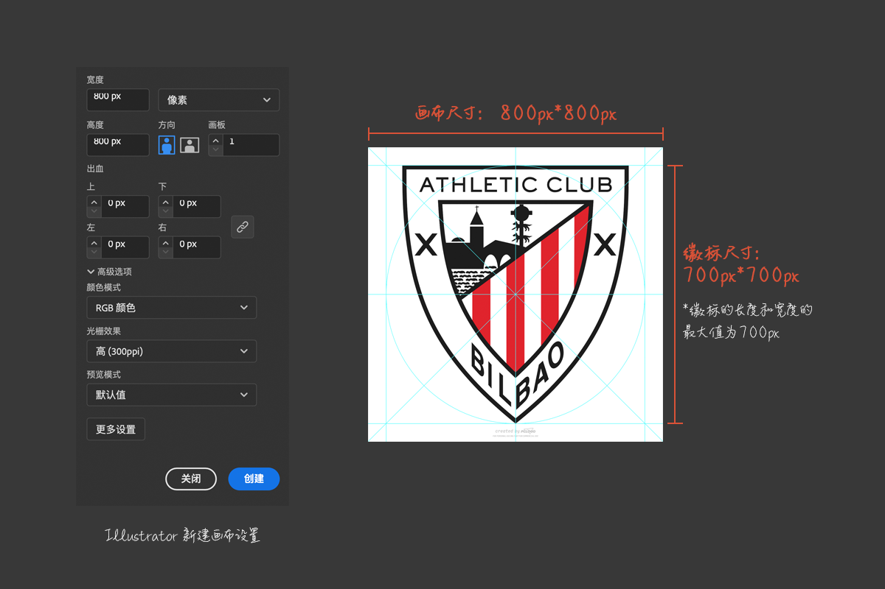

The vector `svg` file of the logo must follow these principles:

- All elements should use **shape fills** instead of strokes, and strokes should be outlined.
- Text needs to be converted to outlines.
- Gradient fills can only use **linear gradients** and **radial gradients**.
- Monochrome logos should not use clipping masks and should use solid fills. You can use the main color of the entity or black (e.g., #171819).
- Monochrome logos are recommended to be created as a **compound path**.
- When saving as `svg` format in Illustrator, set the options as shown below:
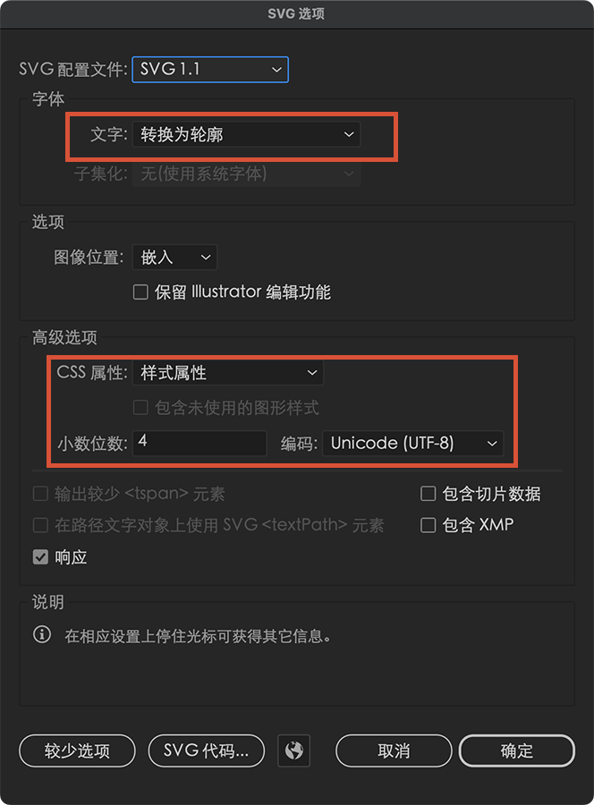

The bitmap `png` file of the logo can be exported directly from the `svg` file. The operation path in Illustrator is:

```
File -> Export -> Export for Screens...
```

### Where to Get Vector Logos

- **Official Websites**: The preferred source. You can search for `svg` files or `pdf` files on the website.
- **Official Social Media**: Official Weibo, X, Facebook, etc. However, these are mostly bitmap files and can be used as references for drawing vector files, such as the monochrome mode of the logo.
- **Wikipedia**: Most of the main images in Wikipedia entries are in `svg` format.
- **Other Vector Logo Download Sites**: Such as [Seeklogo](https://seeklogo.com/), [LOGOS-WORLD](https://logos-world.net/), [WorldVectorLogo](https://worldvectorlogo.com/), etc.
- **Self-drawing**: Refer to bitmap logos on official websites or social media and use Illustrator to convert them to vector format.

## 🔖 Creating the Logo Database

If everything goes well, you have prepared the development environment and logo files. Now we need to import the logo files into the project database.

Most of the following operations will be performed in VS Code. To reduce our workload, we need to install the following two plugins in VS Code:

- [FCLOGO Snippets](https://marketplace.visualstudio.com/items?itemName=iiiRyan.fclogo-snippets): A code snippet plugin that helps us quickly input fields for entities and logos.
- [Folder Templates](https://marketplace.visualstudio.com/items?itemName=Huuums.vscode-fast-folder-structure): A folder template plugin that helps us quickly create folder templates.
  
In addition to installing through the above links, you can also click the **Extensions** icon on the left side of VS Code and search for the extensions by **name** in the marketplace.

### Creating Entity Information

Before importing the logo, you need to confirm whether the entity information of the logo already exists. You can search for entity information on the [index](https://fclogo.top/en/sources/) page.

If the entity information does not exist, follow the subsequent steps to create the entity information. If the entity information already exists, you can skip this step and directly [add logo information](#creating-logo-information) in the entity directory.

#### Creating the Entity Directory

1. Open the project directory with VS Code and navigate to the logo storage directory: `src/data/logos`.
   
   The naming organization principles of the `logos` folder are as follows:

   ```shell
   logos
   |__CFA # Association directory, named after the association abbreviation
      |__clubs # Club directory
      |  |__001_SD Taishan # Club logo directory, named after the sequence number + club name
      |  |__002...
      |__comps # Competition directory
      |  |__001_CSL # Competition logo directory, named after the sequence number + competition name
      |  |__002...
      |__team # National team directory
         |__China National Team # National team logo directory, named after the national team name
   ```
2. According to the entity information of the logo to be imported, search for or create the corresponding folder.
   
   Here, we take the creation of the **La Liga Athletic Bilbao** directory as an example:

   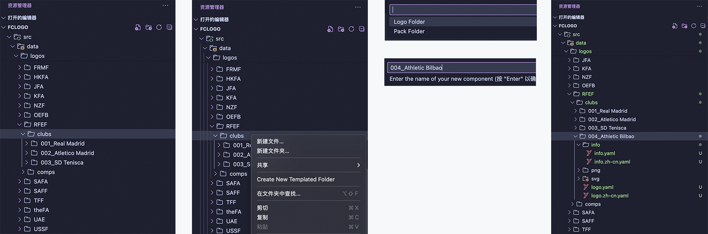

   First, navigate to the `RFEF (Royal Spanish Football Federation)/clubs` directory in the VS Code explorer. We need to create the **Athletic Bilbao** club directory.
   
   Right-click on the `clubs` folder and select `Create New Templated Folder` from the context menu.

   Select the preset template name `Logo Folder` at the top of the VS Code window, then enter the name `004_Athletic Bilbao` and press `Enter` to confirm.

   After completion, you will see the **Athletic Bilbao** club directory we created in the explorer (the rightmost image above).

> The creation method for other types of entities (associations/leagues, competitions, national teams) is similar.

#### Creating Entity Information

Entity information is a brief introduction to the logo entity, including: entity name, country, coordinates, founding year, city, stadium, official website link, social media links, etc.

The complete data fields supported by each entity type are as follows:

| <nobr>Field</nobr> | <nobr>Applicable Entity</nobr> | <nobr>Required</nobr> | <nobr>Default Value</nobr> | <nobr>Description</nobr> |
| --- | --- | --- | --- | --- |
| sourceID |  | Yes |  | The unique identifier of the entity, named as: `association abbreviation-entity type-sequence number`, e.g., `rfef-club-004`. It can only contain lowercase English letters, hyphens, and numbers. |
| status | club | Yes | active | Indicates the current operating status of the club. `active` means the club is operating, `inactive` means the club has stopped operating. |
| type |  | Yes |  | Indicates the entity type, which can only be: `club`, `comp`, `assn`, `team`, representing: club, competition, association/league, national team. |
| nation |  | Yes |  | Indicates the country to which the entity belongs, using the [ISO 3166-1 alpha-3](https://en.wikipedia.org/wiki/ISO_3166-1_alpha-3) three-letter code. **Required for club entities.** |
| coordinates | club | Yes |  | The coordinates of the club's location, represented as an array, with longitude `lon` first and latitude `lat` second, e.g., `[116.447, 39.930]`. |
| timeline |  | No | false | Indicates whether the logo timeline (historical logos) of the entity is fully collected. `true` means complete, `false` means incomplete. |
| fullName |  | Yes |  | The full name of the entity |
| localName |  | Yes |  | The local language name of the entity |
| shortName |  | Yes |  | The short name of the entity |
| founded |  | No |  | The founding year of the entity, only numbers can be used |
| city | club | No |  | The city where the club is located, e.g., `Spain, Madrid`, or `Madrid` |
| ground | club | No |  | The club's home stadium |
| confederation | comp | No |  | The continental confederation to which the competition belongs, e.g., `AFC`, `UEFA` |
| teams |  | No |  | The number of teams in the competition, represented by a number, e.g., `20` |
| level |  | No |  | The level of the competition, e.g., `Level 1` |
| promotion |  | No |  | The competition for promotion |
| relegation |  | No |  | The competition for relegation |
| headquarter | assn | No |  | The city where the association/league headquarters is located |
| affiliations | assn | No |  | The affiliations of the association/league, e.g., `East Asian Football Federation ▸ Asian Football Confederation ▸ FIFA` |
| duration | club | No |  | The operating period of the club, e.g., `1990 - 2000`. This field is only used for clubs that have stopped operating |
| assn | team | No |  | The association to which the team belongs |
| conf | team | No |  | The continental confederation to which the team belongs |
| code | team | No |  | The country code of the team |
| websiteURL |  | No |  | The official website link of the entity |
| twitterURL |  | No |  | The official X (Twitter) link of the entity |
| weiboURL |  | No |  | The official Weibo link of the entity |
| wikiURL |  | No |  | The Wikipedia link of the entity |

We continue to use **Athletic Bilbao** as an example to complete the entity information.

In the `004_Athletic Bilbao` folder we created in the previous step, open `info/info.yaml`, type `cbinfo`, and press `tab` to quickly generate the club entity data template:

```yaml
- data: sourceInfo
  sourceID: ass-club-000
  status: active
  type: club
  nation: nation
  coordinates: [lon, lat]
  timeline: false
  info:
    - fullName: fullname
      localName: localName
      shortName: shortName
      founded: year
      city: city
      ground: ground
  websiteURL: ''
  twitterURL: ''
  weiboURL: ''
  wikiURL: ''
```
Generate the data template, then press `tab` again to complete the information. Non-required fields can be left blank (if there is a default value, delete it). Here is the completed **Athletic Bilbao** entity information:

```yaml
- data: sourceInfo
  sourceID: rfef-club-004
  status: active
  type: club
  nation: ESP
  coordinates: [-2.949361, 43.264167]
  timeline: false
  info:
    - fullName: Athletic Club Bilbao
      localName: Athletic Club de Bilbao
      shortName: Athletic Bilbao
      founded: 1898
      city: Bilbao
      ground: Estadio San Mamés
  websiteURL: 'https://www.athletic-club.eus/en/'
  twitterURL: 'https://twitter.com/AthleticClub'
  weiboURL: ''
  wikiURL: 'https://en.wikipedia.org/wiki/Athletic_Bilbao'
```

In general, at this point, you have successfully created the entity information for a club. Our project currently supports two languages: **English** `en` and **Simplified Chinese** `zh-cn`. Based on the English version, you can create a Simplified Chinese version. Just copy all the content from `info/info.yaml` to `info/info.zh-cn.yaml` and translate the content, as shown below:

```yaml
- data: sourceInfo
  sourceID: rfef-club-004
  status: active
  type: club
  nation: ESP
  coordinates: [-2.949361, 43.264167]
  timeline: false
  info: # Only this part needs to be translated
    - fullName: 毕尔巴鄂竞技俱乐部 #highlight-line
      localName: Athletic Club de Bilbao
      shortName: 毕尔巴鄂竞技 #highlight-line
      founded: 1898
      city: 毕尔巴鄂 #highlight-line
      ground: 圣马梅斯球场 #highlight-line
  websiteURL: 'https://www.athletic-club.eus/en/'
  twitterURL: 'https://twitter.com/AthleticClub'
  weiboURL: ''
  wikiURL: 'https://en.wikipedia.org/wiki/Athletic_Bilbao'
```

The creation of other entity information is similar to the creation of club entity information. The shortcut input code for association/league entity information is `asinfo`, the shortcut input code for competition entity information is `cpinfo`, and the shortcut input code for national team entity information is `ntinfo`.

### Creating Logo Information

#### Organizing Logo Files

Earlier, we prepared the club logos (`svg` and `png` files) to be imported. Now we need to name these logo files.

The naming of logo files follows these principles, and the **`svg` file name and `png` file name must be consistent**:

- File name composition: `ClubEnglishName-vLogoVersionNumber-StyleName-OtherDistinguishingName`
- Club English Name (required): Capitalize the first letter of each word, and use hyphens `-` to connect words
- Logo Version Number (required): Generally the year the logo was adopted
- Style Name (not required): Logo styles include color `color`, monochrome `mono`, etc. The color style is the default style and can be omitted from the file name. Other style names cannot be omitted.
- Other Distinguishing Name (not required): If there are multiple versions of the same logo version and style, you can add another field to the file name to distinguish them.

Here are some acceptable file name examples:

```
Athletic-Club-Bilbao-v2008.svg
Athletic-Club-Bilbao-v2008-mono.svg
Athletic-Club-Bilbao-v2008-digital.svg
Liverpool-Football-Club-v2012-minor.svg
Real-Madrid-v1996-mono-2.svg
```
After naming the logo files, copy the `png` files to the `png` folder under the entity directory and the `svg` files to the `svg` folder under the entity directory.

For example: `004_Athletic Bilbao/png`, `004_Athletic Bilbao/svg`.

#### Creating Logo Information

Logo information includes the logo version, PNG file path, SVG file path, entity ID, style, reference source, contributor ID, etc. The complete data fields supported are as follows:

| <nobr>Field</nobr> | <nobr>Required</nobr> | <nobr>Default Value</nobr> | <nobr>Description</nobr> |
| --- | --- | --- | --- |
| logoID | Yes |  | The unique identifier of the logo, composed of: `creation date-creation time-random hexadecimal number`. The FCLOGO Snippets plugin can automatically generate it |
| version | Yes | 0000 | Generally the year the logo was adopted. If there are multiple logos in the same year, you can use the month to distinguish them, e.g., `2020.02`. If the adoption year of the logo cannot be determined, use the default value `0000` |
| isDoubtful | Yes | false | Whether there is any doubt about the logo information. If there is doubt, it is `true`, otherwise it is `false` |
| isOutdated | Yes | false | Whether it is a historical logo. If it is, it is `true`, otherwise it is `false` |
| verName | No |  | The name used by the entity when using this logo, mostly used for historical logos. It can also be other names of the entity, and can have multiple values, e.g., `['name 1', 'name 2']` |
| slug | Yes |  | The link to the logo details page, composed of `/association abbreviation/entity type/logo file name`, e.g., `/rfef/club/Athletic-Club-Bilbao-v2008` |
| pngPath | Yes |  | The path to the logo PNG file. Note that it should be consistent with the file name. The FCLOGO Snippets plugin can be associated with other fields to generate it |
| svgPath | Yes |  | The path to the logo SVG file. Note that it should be consistent with the file name. The FCLOGO Snippets plugin can be associated with other fields to generate it |
| sourceID | Yes |  | The ID of the logo entity, i.e., the entity information ID created in the previous step, e.g., `rfef-club-004`. The FCLOGO Snippets plugin can be associated with other fields to generate it |
| style | Yes | color | The style code of the logo. Currently supported styles are: color, minor, comm, mono, text, graph, circl, full, star. See the table below |
| reference | No |  | The source of the logo, reference materials |
| ctrbID | No |  | The contributor ID of the logo. If you are contributing a logo for the first time, you need to create your contributor ID first. See: [Creating a Contributor ID](#creating-contributor-id) |

Currently supported logo style names:

| <nobr>Code</nobr> | <nobr>Style</nobr> | <nobr>Description</nobr> |
| --- | --- | --- |
| color | Color | The default style of the logo. **Each logo must include a color version** |
| minor | Minor Logo | The second logo used by the entity |
| comm | Commemorative Logo | The commemorative logo used by the entity, such as anniversary commemorations |
| mono | Monochrome | Monochrome style logo |
| text | Text Logo | The text style of the logo |
| graph | Graphic Logo | The graphic style of the logo |
| circl | Circular Logo | The circular version of the logo |
| star | Champion Star Logo | The logo with champion star style |
| full | Full Logo | The full style of the logo |

> The main styles of the logo are color, minor, and comm.
> Other styles are derivative styles of the main styles of the logo.

We continue to use **Athletic Bilbao** as an example to add the `2008` version of the logo.

In the `004_Athletic Bilbao` folder, open `logo.yaml`, type `lgdata`, and press `tab` to quickly generate the logo data template:

```yaml
- data: logo
  logoID: 20241231-164558-7d2162
  version: 0000
  isDoubtful: false
  isOutdated: false
  verName: [name]
  slug: /name/type/name-v0000-mono
  pngPath: 'png/name-v0000-mono.png'
  svgPath: 'svg/name-v0000-mono.svg'
  sourceID: name-type-000
  style: color
  reference: ''
  ctrbID: ''
```

Generate the data template, then press `tab` again to complete the information. Non-required fields can be left blank (if there is a default value, delete it). Here is the completed logo information:

```yaml
- data: logo
  logoID: 20241231-164728-11487e
  version: 2008
  isDoubtful: false
  isOutdated: false
  verName: ['Athletic Bilbao']
  slug: /rfef/club/Athletic-Club-Bilbao-v2008
  pngPath: 'png/Athletic-Club-Bilbao-v2008.png'
  svgPath: 'svg/Athletic-Club-Bilbao-v2008.svg'
  sourceID: rfef-club-004
  style: color
  reference: 'https://www.athletic-club.eus/en/'
  ctrbID: 'ctrb-ryan'
```

Like the entity information, copy all the content from `logo.yaml` to `logo.zh-cn.yaml` and complete the translation (only the `verName` field needs to be translated, or you can keep the English version):

```yaml
- data: logo
  logoID: 20241231-164728-11487e
  version: 2008
  isDoubtful: false
  isOutdated: false
  verName: ['毕尔巴鄂竞技'] #highlight-line 
  slug: /rfef/club/Athletic-Club-Bilbao-v2008
  pngPath: 'png/Athletic-Club-Bilbao-v2008.png'
  svgPath: 'svg/Athletic-Club-Bilbao-v2008.svg'
  sourceID: rfef-club-004
  style: color
  reference: 'https://www.athletic-club.eus/en/'
  ctrbID: 'ctrb-ryan'
```

#### Creating Contributor ID

Open the file `/src/data/contributors/contributor.yaml` with VS Code and add the following code:

```yaml
- data: contributor
  ctrbID: # ctrb-Name Abbreviation
  name: # Your Name
  link: # Your Profile Link
```

For example:

```yaml
- data: contributor
  ctrbID: ctrb-ryan
  name: iiiRyan
  link: https://weibo.com/u/1652080652
```

## 📤 Submitting Code

At this point, we have successfully added the logo to the local development environment. You can run the following command in the terminal:

```shell
yarn dev
```

After completion, enter: `http://localhost:8000/` in the browser to preview the web page effect.

### Submitting Changes

If everything is normal in the development environment preview, you can submit the code to your project repository.

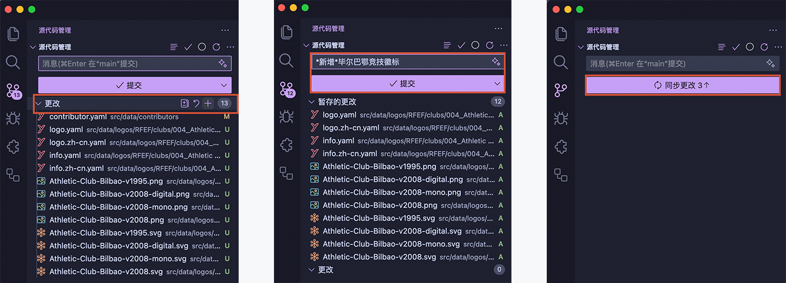

1. Click the **Source Control** icon on the left side of VS Code, click the `+` **Stage All Changes** button on the right side of the **Changes** title.
2. Enter the change information in the text box above the **Commit** button, e.g., `Add Athletic Bilbao logo`, then click the **Commit** button.
3. Click the **Sync Changes** button to sync the code to the remote repository.

After the push is complete, you will see the changes in the Github remote repository.

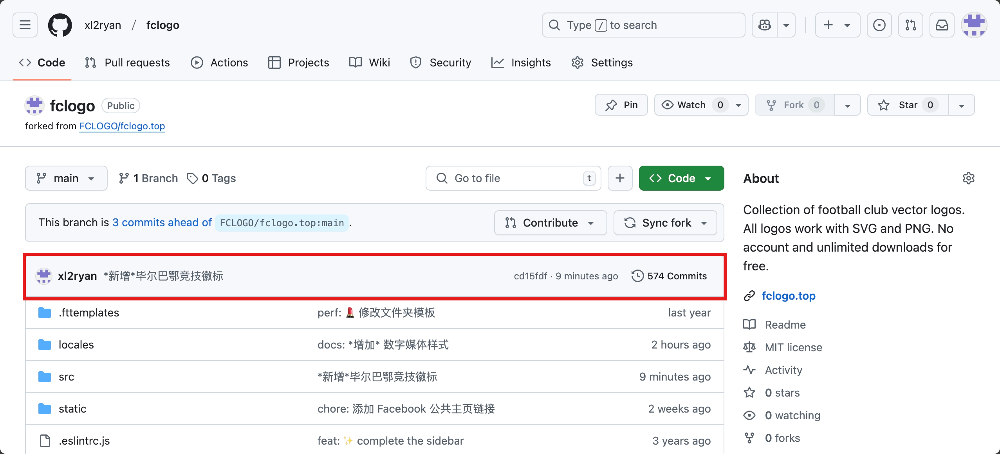

You can also submit through the **terminal/command line tool**:

```shell
# Stage changes
git add .

# Commit change information
git commit -m "Add Athletic Bilbao logo"

# Push to remote repository
git push
```

### Submitting a PR (Pull Request)

Currently, the logo information changes are only stored in your forked project repository. Next, we need to submit the updates to the original project repository.

1. On the main page of your forked project, click `Pull Requests`, then click the `New pull request` button.
   
   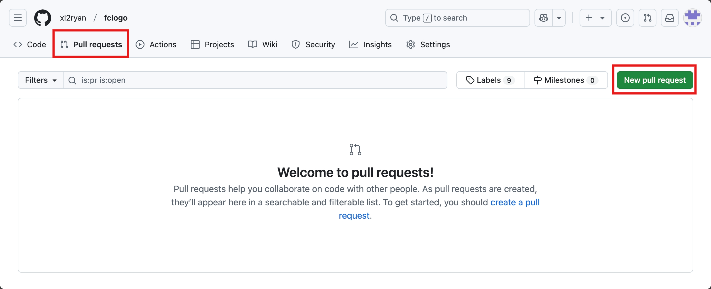

2. Confirm that the repository and branch are correct, then click the `Create pull request` button.
   
   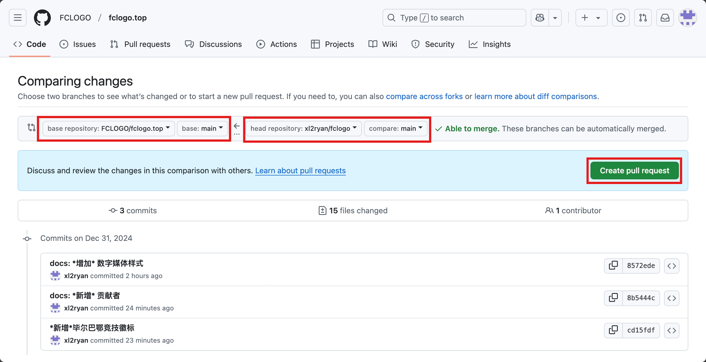

3. Fill in the change information, then click the `Create pull request` button.
   
   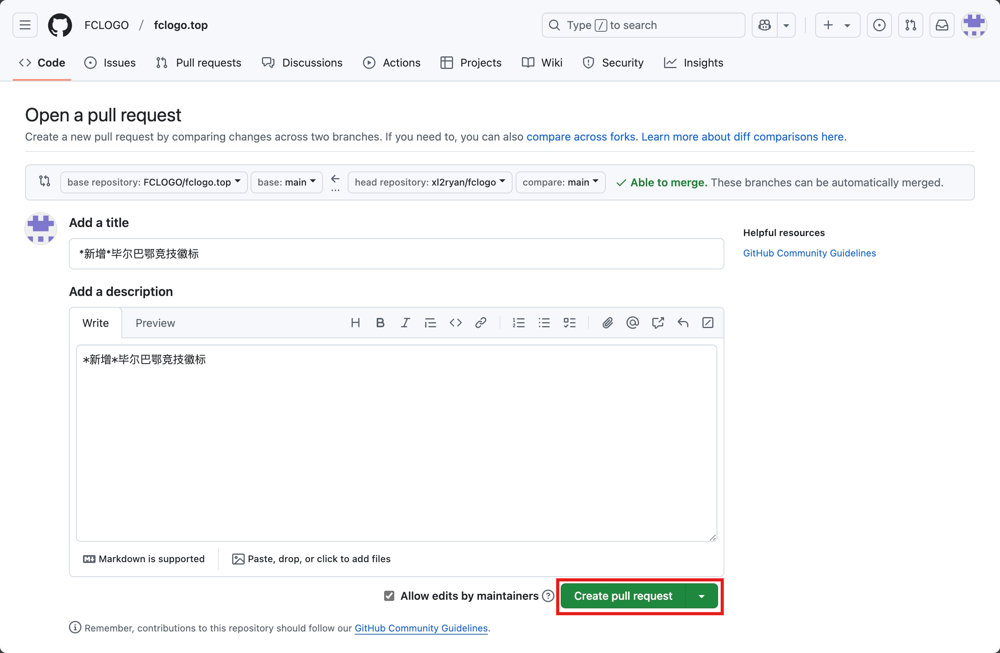

After the review is complete, the logo you submitted will be merged into the main project.

Enjoy It! ✨✨