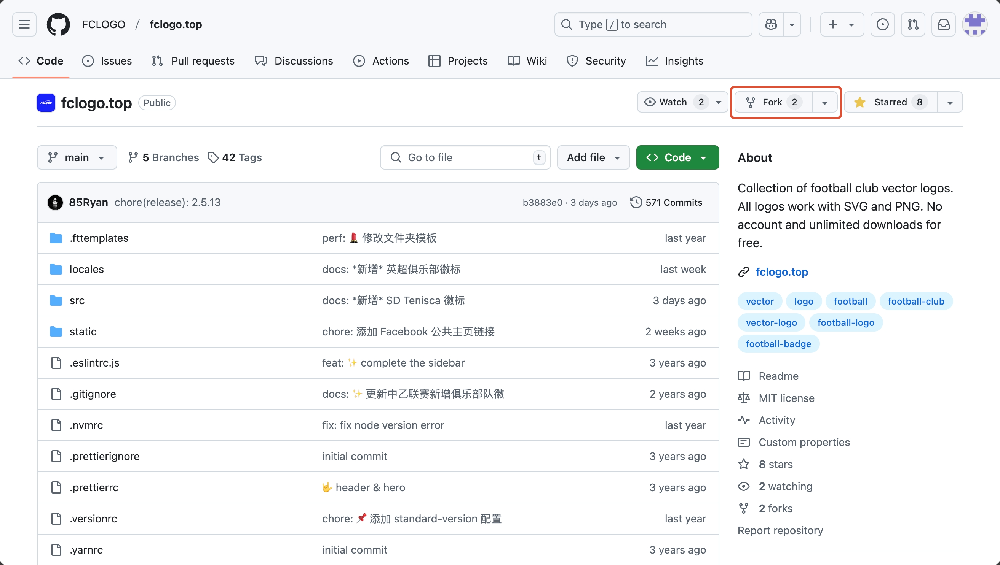
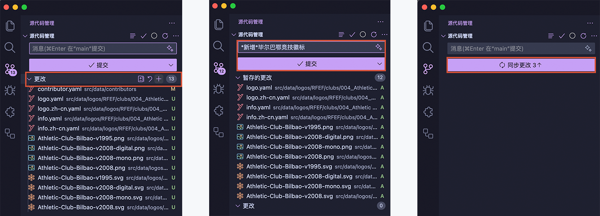
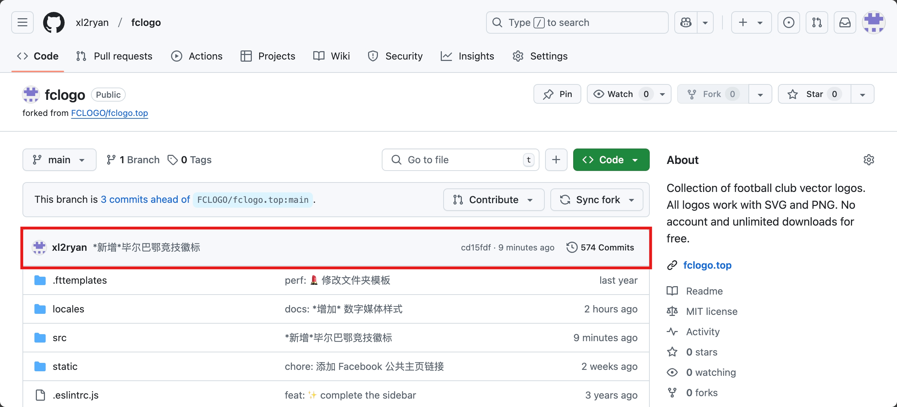
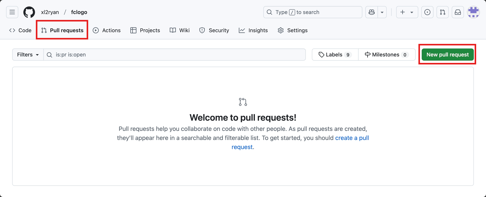
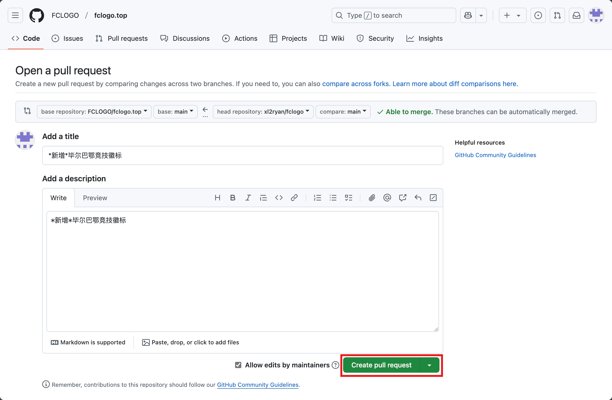

感谢您花时间为我们的项目做出贡献！您所做的任何贡献都将在我们的 [GitHub](https://github.com/FCLOGO/fclogo.top) 上反映 ✨。

欢迎加入我们的 [Discord](https://discord.gg/gVcbysaEWD) 服务器了解更多信息。

在本文档中，您将了解到给我们贡献一个矢量徽标的完整工作流程，使用右上角的目录可以快速进入本指南的特定部分。

## 🛠️ 准备工作

### 矢量图形编辑器

有许多适用于各系统平台的矢量图形编辑器，我们建议您使用 [Adobe Illustrator](https://www.adobe.com/products/illustrator.html)。

当然您也可以根据自身需求选择其他合适的工具，以下几个流行的矢量图形编辑器都是很不错的选择：

- [Affinity Designer](https://affinity.serif.com/zh-cn/designer/)
- [Figma](https://www.figma.com/)
- [INKSCAPE](https://inkscape.org/zh-hans/)
- [Sketch](https://www.sketch.com/)
- [CorelDRAW](https://www.coreldraw.com/cn/)

### 设置开发环境

这一部分将引导您安装以下工具：

- Node.js
- Git
- Visual Studio Code

在安装这些工具之前，您最好能对**命令行**（command line）工具有一些基础的了解，根据计算机使用的操作系统，命令行的使用方法略有不同：

- [macOS 系统命令行使用说明](https://www.macworld.co.uk/feature/mac-software/how-use-terminal-on-mac-3608274/)
- [Windows 系统命令行使用说明](https://www.lifewire.com/how-to-open-command-prompt-2618089)
- [Linux 系统命令行使用说明](https://www.howtogeek.com/140679/beginner-geek-how-to-start-using-the-linux-terminal/)

#### 安装 Node.js

[Node.js](https://nodejs.org/zh-cn)是一个可以在 Web 浏览器之外运行 JavaScript 代码的环境。 我们的项目是使用 Gatsby 构建的。要启动并运行 Gatsby，您需要在计算机上安装 Node.js 版本 18（或更高版本，但低于 v21）。

> 当前本项目使用的 Node.js 版本为：v20.18.1

为方便管理，建议使用 [nvm](https://github.com/nvm-sh/nvm) 或者 [fnm](https://github.com/Schniz/fnm)等 Node 版本管理工具安装，同时需要安装一个包管理器，建议使用 [Yarn](https://yarnpkg.com/)。

以 macOS 系统为例，安装方法如下:

```shell
# 下载安装 nvm:
curl -o- https://raw.githubusercontent.com/nvm-sh/nvm/v0.40.1/install.sh | bash

# 下载安装 Node.js:
nvm install v20.18.1

# 验证 Node.js 版本:
node -v # 应该会输出 "v20.18.1".
nvm current # 应该会输出 "v20.18.1".

# 下载安装 Yarn:
corepack enable yarn

# 验证 Yarn 版本:
yarn -v
```

其他系统平台安装方法请参考： 👉 https://nodejs.org/zh-cn/download

#### 安装 Git

[Git](https://git-scm.com/) 是一个免费开源的分布式版本控制系统。它是一个可以帮助您保存代码的不同版本的工具。它还可以帮助团队成员同时在同一代码库上协同工作。

下载和安装 Git 的步骤取决于您的操作系统。请遵循适合您的系统的指南：

- [macOS 系统安装 Git](https://www.atlassian.com/git/tutorials/install-git#mac-os-x)
- [Windows 系统安装 Git](https://www.atlassian.com/git/tutorials/install-git#windows)
- [Linux 系统安装 Git](https://www.atlassian.com/git/tutorials/install-git#linux)

#### 安装 Visual Studio Code

[Visual Studio Code](https://code.visualstudio.com/)（也简称为 VS Code）是一种流行的代码编辑器，可用于为项目编写代码。如果您还没有首选的代码编辑器，请访问 VS Code 站点并下载适合您的平台的版本。

当然，您也可以使用其他代码编辑器。

#### 创建 Github 账号

本项目的全部代码存储在 Github 中，因此，您需要[创建一个 Github 账户](https://docs.github.com/zh/get-started/start-your-journey/creating-an-account-on-github)来拉取、推送、提交代码。

Github 账户创建完成后，可以参考以下文档设置 Git 及了解一些基础操作：

- [设置 Git](https://docs.github.com/zh/get-started/getting-started-with-git/set-up-git)
- [GitHub 流](https://docs.github.com/zh/get-started/using-github/github-flow)
- [协作处理拉取请求](https://docs.github.com/zh/pull-requests/collaborating-with-pull-requests)

### 复刻项目并拉取项目最新代码



在 [Github](https://github.com/FCLOGO/fclogo.top) 上找到本项目主页，点击右上角的 `fork` 按钮，复刻本项目。


您可以根据需要为项目重新命名，之后点击 `Creat fork` 按钮完成项目复刻。

到这里，您已经复刻了整个项目到您自己的存储库中，如下图所示：


### 创建项目本地副本

接下来我们需要将项目文件克隆到您的计算机中，以方便后续进行修改。

1. 在项目文件列表上方，点击 `<> code` 按钮，根据需要（HTTPS/SSH）复制存储库的 URL。（这里以SSH为例，下同）


2. 打开终端或者其他命令行工具，将当前目录更改为您想要存储克隆目录的位置，输入 `git clone` 然后粘贴之前复制的 URL。如下所示：

```shell
# 将项目 URL 替换为你自己的项目 URL

git clone git@github.com:xl2ryan/fclogo.git

```
3. 按回车键，等待完成，即在您的计算机中创建了项目的副本。

```
Cloning into 'fclogo'...
remote: Enumerating objects: 14584, done.
...
Resolving deltas: 100% (6506/6506), done.
```

### 配置 Git，与原项目存储库同步

为了使保持与原项目存储库更新保持同步，您可以对 Git 做以下配置：

**1. 添加原项目存储库远程地址**

在项目目录位置，在终端输入以下命令：

```shell
git remote add upstream git@github.com:FCLOGO/fclogo.top.git
```
如果您使用的是 HTTPS，则 URL 为：`https://github.com/FCLOGO/fclogo.top.git`

若要验证为分支指定的新上游存储库，在终端中键入 `git remote -v`。 你应该会看到分支的 URL 为 `origin`，上游存储库的 URL 为 `upstream`。

```shell
$ git remote -v                                               
origin	git@xlgit.com:xl2ryan/fclogo.git (fetch)
origin	git@xlgit.com:xl2ryan/fclogo.git (push)
upstream	git@github.com:FCLOGO/fclogo.top.git (fetch)
upstream	git@github.com:FCLOGO/fclogo.top.git (push)
```

**2. 同步原始项目**

在项目目录位置，在终端输入以下命令，同步原始项目：

```shell
git fetch upstream
```

将本地默认分支与原项目分支合并：

```shell
git merge upstream/main
```
这会使复刻的默认分支与原始仓库同步，而不会丢失本地更改。

### 本地项目运行

至此，您已基本完成了前期的准备工作，一切正常的话，您可以在项目目录下，终端运行以下命令：

```shell
# 安装项目依赖
yarn install

# 本地运行开发调试
yarn dev
```

当终端中输出以下内容时，即表示项目上本地运行成功，您就可以在浏览器中输入地址：`http://localhost:8000/` 查看项目了✨

```
You can now view fclogo.top in the browser.
⠀
  http://localhost:8000/
⠀
View GraphiQL, an in-browser IDE, to explore your site's data and schema
⠀
  http://localhost:8000/___graphql
⠀
Note that the development build is not optimized.
To create a production build, use gatsby build
```

## 🎨 准备矢量徽标

目前项目收集的徽标包含：**协会/联盟**、**国家队**、**赛事**、**俱乐部**四种主体类型的徽标。

每个徽标必须包含 PNG 位图 `png` 格式和 SVG 矢量 `svg` 格式，尺寸为：**800px*800px**，**无背景**。

Illustrator 画布尺寸参考下图：


徽标的矢量 `svg` 文件须遵循以下原则：

- 所有元素应该使用**形状填充**，而不是描边，须将**描边轮廓化**。
- 文字需要转换轮廓。
- 渐变填充只能使用**线性渐变**和**径向渐变**。
- 单色徽标不要使用剪切蒙版，应该使用纯色填充。可以使用主体主色，或者黑色（eg: #171819）。
- 单色徽标建议整体创建一个**复合路径**。
- Illustrator 保存为 `svg` 格式时，选项设置如下图：


徽标位图 `png` 文件可以直接从 `svg` 文件导出，Illustrator 操作路径为：

```
文件 -> 导出 -> 导出为多种屏幕所用格式...
```

### 从哪里获取矢量徽标

- **官方网站**：首选获取路径，可以搜寻网站中的 `svg` 文件或者 `pdf` 文件。
- **官方社交媒体**：官方微博、X、Facebook等等，但这里更多为位图文件，可作为矢量文件的绘制参考，比如徽标的单色模式。
- **维基百科**：维基百科中的词条主图大部分为 `svg` 格式。
- **其他矢量标志下载网站**：比如 [Seeklogo](https://seeklogo.com/)、[LOGOS-WORLD](https://logos-world.net/)、[WorldVectorLogo](https://worldvectorlogo.com/)……
- **自己绘制**：参考官方网站或者社交媒体中的位图标志，使用 Illustrator 转化矢量格式。

## 🔖 创建徽标数据库

一切顺利的话，您已经准备好了开发环境以及徽标文件，现在我们需要将徽标文件导入到项目数据库中。

接下来的大部分操作将会在 VS Code 中进行，为了减少我们的工作量，需要在 VS Code 中安装以下两个插件：

- [FCLOGO Snippets](https://marketplace.visualstudio.com/items?itemName=iiiRyan.fclogo-snippets)：代码片段插件，可以帮助我们快速输入主体及徽标的字段模板。
- [Folder Templates](https://marketplace.visualstudio.com/items?itemName=Huuums.vscode-fast-folder-structure)：文件夹模板插件，可以帮助我们快速创建文件夹模板。
  
除了通过点击上述链接安装外，也可以直接点击 VS Code 左侧的**扩展**图标，在应用商店中使用**名称**搜索扩展。

### 创建主体信息

在导入徽标前，需要先确认徽标的主体信息是否已经存在，可以在[索引](https://fclogo.top/zh-cn/sources/)页面检索主体信息。

如果主体信息不存在，则按后续步骤创建主体信息。如果主体信息已存在，此步可跳过，直接在主体目录中[添加徽标信息](#创建徽标信息)。

#### 创建主体目录

1. 使用 VS Code 打开项目目录，定位到徽标存储目录：`src/data/logos`。
   
   `logos` 文件夹命名组织原则如下：

   ```shell
   logos
   |__CFA #协会目录，以协会名称缩写命名
      |__clubs #俱乐部目录
      |  |__001_SD Taishan #俱乐部徽标目录，以顺序编号+俱乐部名称命名
      |  |__002...
      |__comps #赛事目录
      |  |__001_CSL #赛事徽标目录，以顺序编号+赛事名称命名
      |  |__002...
      |__team #国家队目录
         |__China National Team #国家队徽标目录，以国家队名称命名
   ```
2. 根据要导入徽标的主体信息，检索或者创建相应的文件夹。
   
   此处以创建**西甲毕尔巴鄂竞技**目录为例：

   

   首先在 VS Code 资源管理器中定位至 `RFEF（西班牙皇家足球协会）/clubs`目录，我们需要创建**毕尔巴鄂竞技**俱乐部目录。
   
   在 `clubs` 文件夹处点击鼠标右键，在弹出的菜单中选择 `Create New Templated Folder`。

   在 VS Code 窗口顶端选择预设模板名称：`Logo Folder`，然后输入名称：`004_Athletic Bilbao`，按`回车键`确认。

   完成后，在资源管理器中就能看到我们创建完成的**毕尔巴鄂竞技**俱乐部目录（上图最右图）。

> 其他类型主体（协会/联盟、赛事、国家队）目录创建方式类似。

#### 创建主体信息

主体信息即徽标主体简介，包括：主体名称、国家、位置坐标、成立年份、城市、主场、官网链接、社交媒体链接等等。

各主体类型支持的完整数据字段如下：

| <nobr>字段</nobr> | <nobr>适用主体</nobr> | <nobr>是否必填</nobr> | <nobr>默认值</nobr> | <nobr>说明</nobr> |
| --- | --- | --- | --- | --- |
| sourceID |  | 是 |  | 主体的唯一标识符，命名规则为：`协会简称-主体类型-顺序号`，例如：`rfef-club-004`。只能包含英文小写字母、连接符和数字。 |
| status | club | 是 | active | 表示俱乐部当前运营状态，`active` 表示俱乐部运营中，`inactive` 表示俱乐部已停止运营。 |
| type |  | 是 |  | 表示主体类型，只能是：`club`、`comp`、`assn`、`team`四个值，分别表示：俱乐部、赛事、协会/联盟、国家队。 |
| nation |  | 是 |  | 表示主体所属国家，使用 [ISO 3166-1 alpha-3](https://zh.wikipedia.org/wiki/ISO_3166-1%E4%B8%89%E4%BD%8D%E5%AD%97%E6%AF%8D%E4%BB%A3%E7%A0%81) 三字母代码表示。**俱乐部主体必填。** |
| coordinates | club | 是 |  | 俱乐部位置坐标信息，用一个数组表示，经度`lon`在前，纬度`lat`在后，例如：`[116.447, 39.930]`。 |
| timeline |  | 否 | false | 表示主体徽标时间线（历史徽标）是否全部收集。`true`表示完成，`false`表示未完成。|
| fullName |  | 是 |  | 主体全称 |
| localName |  | 是 |  | 主体本地语言名称 |
| shortName |  | 是 |  | 主体简称 |
| founded |  | 否 |  | 主体成立年份，只能使用数字 |
| city | club | 否 |  | 俱乐部所在城市，例如：`西班牙，马德里`，或者`马德里` |
| ground | club | 否 |  | 俱乐部主场体育场 |
| confederation | comp | 否 |  | 赛事所属洲际联盟，例如：`AFC`、`UEFA` |
| teams |  | 否 |  | 赛事球队数量，用数字表示，例如：`20` |
| level |  | 否 |  | 赛事级别，例如：`第 1 级` |
| promotion |  | 否 |  | 赛事升级参加赛事 |
| relegation |  | 否 |  | 赛事降级参加赛事 |
| headquarter | assn | 否 |  | 协会/联盟总部所在城市 |
| affiliations | assn | 否 |  | 协会/联盟的隶属关系，例如：`东亚足联 ▸ 亚足联 ▸ 国际足联` |
| duration | club | 否 |  | 俱乐部运营周期，例如：`1990 - 2000`，此字段仅用于停止运营的俱乐部 |
| assn | team | 否 |  | 队伍所属协会 |
| conf | team | 否 |  | 队伍所属洲际联盟 |
| code | team | 否 |  | 队伍国家简码 |
| websiteURL |  | 否 |  | 主体官方网站链接 |
| twitterURL |  | 否 |  | 主体官方 X（推特）链接 |
| weiboURL |  | 否 |  | 主体官方微博链接 |
| wikiURL |  | 否 |  | 主体维基百科链接 |

我们继续以**毕尔巴鄂竞技**为例，完成主体信息。

在我们上一步建立的 `004_Athletic Bilbao` 文件夹中，打开 `info/info.yaml`，键入 `cbinfo`，按 `tab`键，即可快速生成俱乐部主体数据模板：

```yaml
- data: sourceInfo
  sourceID: ass-club-000
  status: active
  type: club
  nation: nation
  coordinates: [lon, lat]
  timeline: false
  info:
    - fullName: fullname
      localName: localName
      shortName: shortName
      founded: year
      city: city
      ground: ground
  websiteURL: ''
  twitterURL: ''
  weiboURL: ''
  wikiURL: ''
```
生成数据模板后，继续按 `tab` 键，依次补全数据信息，非必填项可以留空（如有默值，则删除）。以下是补全完成的**毕尔巴鄂竞技**主体信息：

```yaml
- data: sourceInfo
  sourceID: rfef-club-004
  status: active
  type: club
  nation: ESP
  coordinates: [-2.949361, 43.264167]
  timeline: false
  info:
    - fullName: Athletic Club Bilbao
      localName: Athletic Club de Bilbao
      shortName: Athletic Bilbao
      founded: 1898
      city: Bilbao
      ground: Estadio San Mamés
  websiteURL: 'https://www.athletic-club.eus/en/'
  twitterURL: 'https://twitter.com/AthleticClub'
  weiboURL: ''
  wikiURL: 'https://en.wikipedia.org/wiki/Athletic_Bilbao'
```

一般情况下，到这里您已经成功创建了一个俱乐部的主体信息。我们的项目目前支持**英语**`en`和**简体中文**`zh-cn`两种语言，在完成英语版本的基础上，您可以继续创建一个简体中文版本。只需要复制 `info/info.yaml` 中的全部内容到 `info/info.zh-cn.yaml` 文件中，然后翻译其中的内容即可，如下：

```yaml
- data: sourceInfo
  sourceID: rfef-club-004
  status: active
  type: club
  nation: ESP
  coordinates: [-2.949361, 43.264167]
  timeline: false
  info: # 只需要翻译这部分信息
    - fullName: 毕尔巴鄂竞技俱乐部 #highlight-line
      localName: Athletic Club de Bilbao
      shortName: 毕尔巴鄂竞技 #highlight-line
      founded: 1898
      city: 毕尔巴鄂 #highlight-line
      ground: 圣马梅斯球场 #highlight-line
  websiteURL: 'https://www.athletic-club.eus/en/'
  twitterURL: 'https://twitter.com/AthleticClub'
  weiboURL: ''
  wikiURL: 'https://en.wikipedia.org/wiki/Athletic_Bilbao'
```

其他主体信息的创建与俱乐部主体信息的创建类似。协会/联盟主体信息快捷输入代码为 `asinfo`，赛事主体的快捷输入代码为：`cpinfo`，国家队主体快捷输入代码为：`ntinfo`。

### 创建徽标信息

#### 组织徽标文件

前面我们已经准备好了要导入的俱乐部徽标（`svg` 与 `png` 文件），现在需要为这些徽标文件命名。

徽标文件命名遵循以下原则，**`svg` 文件名与 `png` 文件名须保持一致**：

- 文件名组成：`俱乐部英文名称-v徽标版本号-样式名-其他区分名`
- 俱乐部英文名称（必需）：单词首字母大写，单词之间用连接符 `-` 连接
- 徽标版本号（必需）：一般为徽标启用年份
- 样式名（非必需）：徽标样式包括彩色`color`、单色`mono`……等等，彩色样式为默认样式，文件名中可省略，其他样式名不可省略。
- 其他区分名（非必需）：如果徽标的同一版本、同一样式中，又存在多个版本，文件名可以再添加一个字段来区分。

以下是几个可以接受的文件名称示例：

```
Athletic-Club-Bilbao-v2008.svg
Athletic-Club-Bilbao-v2008-mono.svg
Athletic-Club-Bilbao-v2008-digital.svg
Liverpool-Football-Club-v2012-minor.svg
Real-Madrid-v1996-mono-2.svg
```
徽标文件命名完成后，将 `png` 文件复制至主体目录下的 `png` 文件夹， `svg` 文件复制至主体目录下的 `svg` 文件夹。

例如：`004_Athletic Bilbao/png`、`004_Athletic Bilbao/svg`。

#### 创建徽标信息

徽标信息包含徽标的版本、PNG 文件路径、SVG 文件路径、主体ID、样式、参考来源、贡献都ID等，支持的完整数据字段如下：

| <nobr>字段</nobr> | <nobr>是否必填</nobr> | <nobr>默认值</nobr> | <nobr>说明</nobr> |
| --- | --- | --- | --- |
| logoID | 是 |  | 徽标的唯一标识符，组成规则为：`创建日期-创建时间-随机十六进制数`。FCLOGO Snippets 插件可自动生成 |
| version | 是 | 0000 | 一般徽标的启用年份，同一年份有多个徽标时，可用月份区分，如：`2020.02`。如果无法确定徽标启用年份，使用默认值 `0000` |
| isDoubtful | 是 | false | 徽标信息是否存在疑问，有疑问为`true`，默认为没有疑问 `false` |
| isOutdated | 是 | false | 是否为历史徽标，是为 `true`，正在使用的徽标则为 `false` |
| verName | 否 |  | 主体是使用此徽标时用的名称，多用于历史徽标。也可以为主体的其他名称等，可以为多个值。例如：`['name 1', 'name 2']` |
| slug | 是 |  | 徽标详情页面链接，组成规则为 `/协会简称/主体类型/徽标文件名`，例如：`/rfef/club/Athletic-Club-Bilbao-v2008` |
| pngPath | 是 |  | 徽标 PNG 文件路径。注意与文件名称保持一致。FCLOGO Snippets 插件可与其他字段关联生成 |
| svgPath | 是 |  | 徽标 SVG 文件路径。注意与文件名称保持一致。FCLOGO Snippets 插件可与其他字段关联生成 |
| sourceID | 是 |  | 徽标主体的ID，即上一步中创建的主体信息ID，例如：`rfef-club-004`.FCLOGO Snippets 插件可与其他字段关联生成 |
| style | 是 | color | 徽标的样式代码。目前支持的样式有：color、minor、comm、mono、text、graph、circl、full、star。参见下表 |
| reference | 否 |  | 徽标来源、资料参考 |
| ctrbID | 否 |  | 徽标贡献者ID，如果您是第一次贡献徽标，需要先创建您的贡献者ID，参见：[创建贡献者ID](#创建贡献者id) |

目前支持的部分徽标样式名：

| <nobr>代码</nobr> | <nobr>样式</nobr> | <nobr>说明</nobr> |
| --- | --- | --- |
| color | 彩色 | 徽标的默认样式。**每个徽标必须包含一个彩色版本** |
| minor | 次要徽标 | 主体使用的第二徽标 |
| comm | 纪念徽标 | 主体使用的纪念徽标，比如周年纪念等 |
| mono | 单色 | 单色样式徽标 |
| text | 文字徽标 | 徽标的文字样式 |
| graph | 图形徽标 | 徽标的图形样式 |
| circl | 圆形徽标 | 徽标的圆形版本 |
| star | 冠军星标 | 徽标包含冠军星样式 |
| full | 完整徽标 | 徽标的完整样式 |

> color、minor、comm 三种样式为徽标的主要样式。
> 其他样式为徽标主要样式的衍生样式。

我们继续以**毕尔巴鄂竞技**为例，添加个`2008`版本的徽标。

在 `004_Athletic Bilbao` 文件夹中，打开 `logo.yaml`，键入 `lgdata`，按 `tab`键，即可快速生成徽标数据模板：

```yaml
- data: logo
  logoID: 20241231-164558-7d2162
  version: 0000
  isDoubtful: false
  isOutdated: false
  verName: [name]
  slug: /name/type/name-v0000-mono
  pngPath: 'png/name-v0000-mono.png'
  svgPath: 'svg/name-v0000-mono.svg'
  sourceID: name-type-000
  style: color
  reference: ''
  ctrbID: ''
```

生成数据模板后，继续按 `tab` 键，依次补全数据信息，非必填项可以留空（如有默值，则删除）。以下是补全完成的徽标信息：

```yaml
- data: logo
  logoID: 20241231-164728-11487e
  version: 2008
  isDoubtful: false
  isOutdated: false
  verName: ['Athletic Bilbao']
  slug: /rfef/club/Athletic-Club-Bilbao-v2008
  pngPath: 'png/Athletic-Club-Bilbao-v2008.png'
  svgPath: 'svg/Athletic-Club-Bilbao-v2008.svg'
  sourceID: rfef-club-004
  style: color
  reference: 'https://www.athletic-club.eus/en/'
  ctrbID: 'ctrb-ryan'
```

和主体信息一样，复制 `logo.yaml` 中的全部内容到 `logo.zh-cn.yaml` 中，完成页面中文翻译（只需翻译 `verName` 字段，不作翻译保持英文版本也可）：

```yaml
- data: logo
  logoID: 20241231-164728-11487e
  version: 2008
  isDoubtful: false
  isOutdated: false
  verName: ['毕尔巴鄂竞技'] #highlight-line 
  slug: /rfef/club/Athletic-Club-Bilbao-v2008
  pngPath: 'png/Athletic-Club-Bilbao-v2008.png'
  svgPath: 'svg/Athletic-Club-Bilbao-v2008.svg'
  sourceID: rfef-club-004
  style: color
  reference: 'https://www.athletic-club.eus/en/'
  ctrbID: 'ctrb-ryan'
```

#### 创建贡献者ID

使用 VS Code 打开文件 `/src/data/contributors/contributor.yaml`，添加以下代码：

```yaml
- data: contributor
  ctrbID: # ctrb-名称缩写
  name: # 您的名字
  link: # 您的主面链接
```

例如：

```yaml
- data: contributor
  ctrbID: ctrb-ryan
  name: iiiRyan
  link: https://weibo.com/u/1652080652
```

## 📤 提交代码

至此，我们已成功地将徽标添加到本地开发环境中，可以终端中运行以下命令：

```shell
yarn dev
```

完成后,在浏览器中输入：`http://localhost:8000/` 预览网页效果。

### 提交更改

开发环境下预览一切正常，您就可以将代码提交至您的项目存储库中。



1. 点击 VS Code 左侧**源代码管理**图标，点击**更改**标题最右侧 `+` **暂存所有更改**。
2. 在**提交**按钮上面的文本框中输入更改信息，例如：`新增毕尔巴鄂竞技徽标`，然后点击**提交**按钮。
3. 点击**同步更改**按钮，将代码同步推送到远程存储库。

等推送完成后，您就可以在 Github 远程存储库中看到这次更改了。



上述流程，您也可以直接在**终端/命令行工具**中提交：

```shell
# 暂存更改
git add .

# 提交更改信息
git commgit commit -m "新增毕尔巴鄂竞技徽标"

# 推送远程仓库
git push
```

### 提交 PR（Pull Requests）

目前，更改的徽标信息仅存储于您复刻的项目库中，接下来，我们需要将更新提交合并至项目源存储库中。

1. 在您复刻的项目主面，依次点击 `Pull Requests`、`New pull request` 按钮。
   
   

2. 确认存储库与分支无误后，点击 `Create pull request` 按钮。
   
   

3. 填写更改信息后，点击 `Create pull request` 按钮。
   
   

等待审核完成后，您提交的徽标就会合并到主项目中了。

Enjoy It! ✨✨